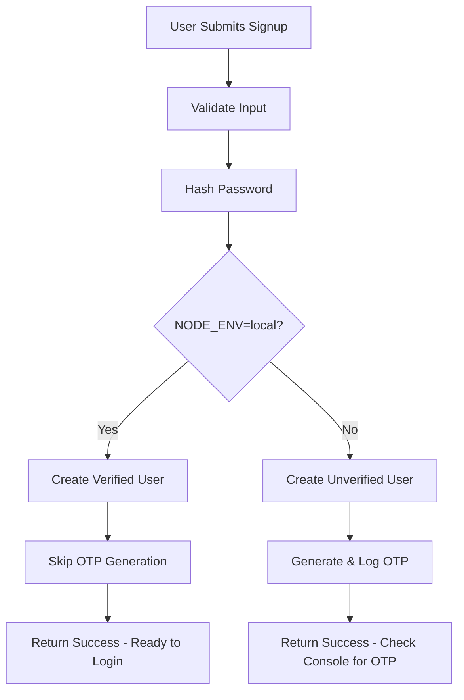
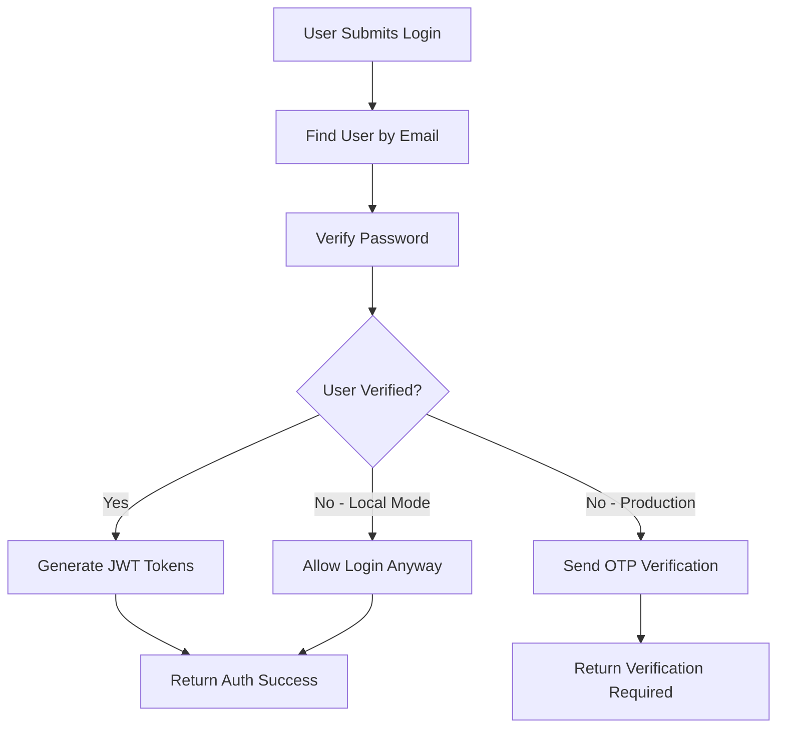
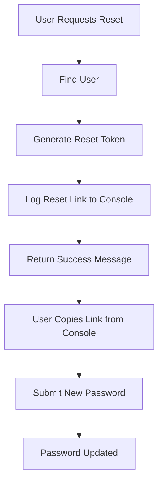

# Local Development Authentication Setup

```
🚀 BruhMCP Local Development Guide
┌─────────────────────────────────────────────────────────────┐
│                                                             │
│  ┌─────┐   ┌──────────┐   ┌─────────────┐   ┌──────────┐   │
│  │     │   │          │   │             │   │          │   │
│  │ 🔧  │──▷│   Auth   │──▷│   Console   │──▷│  No OTP  │   │
│  │     │   │  System  │   │   Logging   │   │ Required │   │
│  └─────┘   └──────────┘   └─────────────┘   └──────────┘   │
│                                                             │
│  Skip SMTP ✓  Auto-Verify ✓  Console OTP ✓  Fast Setup ✓  │
│                                                             │
└─────────────────────────────────────────────────────────────┘
```

This guide walks you through setting up local development authentication for BruhMCP, where email verification is simulated through console logging instead of requiring SMTP configuration.

## Overview

The local development authentication system provides a streamlined development experience by:

- **Auto-verifying users** on signup (no OTP required)
- **Simulating email sending** via enhanced console output
- **Disabling SMTP requirements** for faster setup
- **Maintaining full auth flow** for production compatibility

## Quick Start

### 1. Environment Setup

Create your `.env` file in the `/backend/` directory:

```bash
# Copy the example file
cp .env.example .env
```

### 2. Essential Environment Variables

Add these key variables to your `.env` file:

```bash
# Local Development Mode (CRITICAL)
NODE_ENV=local

# Database (Required)
DB_PASSWORD=your_actual_database_password

# JWT Secrets (Required - Generate strong secrets)
JWT_SECRET=your-super-secret-jwt-key-min-32-chars
JWT_REFRESH_SECRET=your-super-secret-refresh-key-min-32-chars

# Local Development Features
DISABLE_PAYMENTS=true
```

### 3. Start Development

```bash
# Backend
cd backend
npm run dev

# Frontend (separate terminal)
cd frontend
npm run dev
```

## Local Development Mode Features

### Automatic User Verification

When `NODE_ENV=local`, the signup process automatically verifies users:

```javascript
// In signup.js - Users are auto-verified
isVerified: process.env.NODE_ENV === 'local'
```

**Result**: Users can immediately log in after signup without email verification.

### Email Simulation

Instead of sending real emails, the system outputs beautifully formatted console messages:

```
==================================================
📧 EMAIL SIMULATION - SIGNUP_VERIFICATION
==================================================
To: user@example.com
Subject: Welcome! Verify your email to get started

Content:
------------------------------
🎉 Welcome to our platform!

Thanks for signing up! To complete your account setup...

Your verification code is: 123456

This code will expire in 5 minutes for security.
------------------------------

🕒 This signup_verification code expires in 5 minutes
==================================================
```

### Supported Email Types

The system simulates these email types with console output:

1. **Signup Verification** (`signup_verification`)
2. **Login OTP** (`login_otp`) 
3. **Password Reset** (`password_reset`)
4. **Email Change Verification** (`email_change_verification`)

## Authentication Flow in Local Mode

### User Signup Flow



### User Login Flow  



### Password Reset Flow



## Console Output Examples

### Signup Verification
```
📧 EMAIL SIMULATION - SIGNUP_VERIFICATION
To: john@example.com
Subject: Welcome! Verify your email to get started

🎉 Welcome to our platform!
Your verification code is: 456789
This code will expire in 5 minutes for security.
```

### Password Reset
```
=== PASSWORD RESET EMAIL SIMULATION ===
To: john@example.com
Subject: Password Reset Request
Message: Click the link below to reset your password:
https://localhost:5173/reset-password?token=eyJhbGciOiJIUzI1NiIs...
This link will expire in 1 hour.
=====================================
```

### Login OTP (if needed)
```
📧 EMAIL SIMULATION - LOGIN_OTP
To: john@example.com
Subject: Your login verification code

🔐 Secure Login Verification
Your login verification code is: 789123
This code will expire in 5 minutes.
```

## Testing the Authentication System

### 1. Test User Signup

```bash
# Using curl
curl -X POST http://localhost:5000/api/auth/signup \
  -H "Content-Type: application/json" \
  -d '{
    "firstName": "John",
    "lastName": "Doe", 
    "email": "john@example.com",
    "password": "SecurePassword123!"
  }'
```

**Expected Response (Local Mode):**
```json
{
  "success": true,
  "message": "Account created and verified! You can now log in.",
  "data": {
    "userId": "uuid-here",
    "email": "john@example.com",
    "requiresVerification": false,
    "step": "completed"
  }
}
```

### 2. Test User Login

```bash
curl -X POST http://localhost:5000/api/auth/login \
  -H "Content-Type: application/json" \
  -d '{
    "email": "john@example.com",
    "password": "SecurePassword123!"
  }'
```

**Expected Response:**
```json
{
  "success": true,
  "message": "Login successful",
  "data": {
    "user": {
      "id": "uuid-here",
      "email": "john@example.com",
      "firstName": "John",
      "lastName": "Doe",
      "isVerified": true
    },
    "tokens": {
      "accessToken": "jwt-access-token",
      "refreshToken": "jwt-refresh-token"
    }
  }
}
```

### 3. Test Password Reset

```bash
# Request reset
curl -X POST http://localhost:5000/api/auth/forgot-password \
  -H "Content-Type: application/json" \
  -d '{"email": "john@example.com"}'
```

Check console output for the reset link, then:

```bash
# Reset password using token from console
curl -X POST http://localhost:5000/api/auth/reset-password \
  -H "Content-Type: application/json" \
  -d '{
    "token": "token-from-console-output",
    "newPassword": "NewSecurePassword123!"
  }'
```

## Frontend Testing

### Using the React Frontend

1. **Navigate to signup**: `http://localhost:5173/signup`
2. **Fill out the form** with test data
3. **Submit** - user is immediately verified in local mode
4. **Navigate to login**: `http://localhost:5173/login`
5. **Login with credentials** - should work immediately

### Key Differences in Local Mode

| Feature | Production Mode | Local Development Mode |
|---------|----------------|----------------------|
| Email Verification | Required via SMTP | Auto-verified on signup |
| OTP Delivery | Real email sent | Console logging only |
| SMTP Configuration | Required | Not needed |
| Signup Flow | Create → Verify → Login | Create → Login immediately |
| Password Reset | Email with link | Console logging |
| Development Speed | Slower (email setup) | Faster (no email config) |

## Environment Variables Reference

### Required for Local Development

```bash
# CRITICAL: Enables local development mode
NODE_ENV=local

# Database connection (adjust for your setup)
DB_HOST=localhost
DB_PORT=5432
DB_NAME=bruhMCP
DB_USER=your_db_user
DB_PASSWORD=your_db_password

# JWT secrets (generate strong random strings)
JWT_SECRET=your-super-secret-jwt-key-minimum-32-characters
JWT_REFRESH_SECRET=your-super-secret-refresh-key-minimum-32-characters

# Frontend connection
FRONTEND_URL=http://localhost:5173
CORS_ORIGIN=http://localhost:5173

# Disable payments for local dev
DISABLE_PAYMENTS=true
```

### Optional (with defaults)

```bash
# Server configuration
PORT=5000

# Security settings
BCRYPT_ROUNDS=12
OTP_EXPIRY_MINUTES=5
MAX_OTP_ATTEMPTS=3

# Rate limiting
RATE_LIMIT_WINDOW_MS=900000
RATE_LIMIT_MAX_REQUESTS=100
```

### Not Needed in Local Mode

```bash
# SMTP settings (not required for local development)
# SMTP_HOST=your_smtp_host
# SMTP_PORT=587
# SMTP_USERNAME=your_smtp_username  
# SMTP_PASSWORD=your_smtp_password

# Payment gateway (disabled in local mode)
# RAZORPAY_KEY_ID=your_razorpay_key_id
# RAZORPAY_KEY_SECRET=your_razorpay_key_secret
```

## Troubleshooting

### Common Issues

#### 1. Users Not Auto-Verified

**Problem**: Users still need email verification
**Solution**: Ensure `NODE_ENV=local` is set correctly

```bash
# Check your .env file
cat backend/.env | grep NODE_ENV

# Should show: NODE_ENV=local
```

#### 2. Console Emails Not Appearing

**Problem**: Not seeing email simulation in console
**Solution**: Check your NODE_ENV and console output

```bash
# Backend console should show colorful email simulations
# Look for lines starting with "📧 EMAIL SIMULATION"
```

#### 3. JWT Token Errors

**Problem**: Login fails with token errors
**Solution**: Ensure JWT secrets are set and long enough

```bash
# Generate secure JWT secrets (32+ characters)
node -e "console.log(require('crypto').randomBytes(32).toString('hex'))"
```

#### 4. Database Connection Issues

**Problem**: Cannot connect to PostgreSQL
**Solution**: Verify database is running and credentials are correct

```bash
# Test database connection
psql -h localhost -U your_db_user -d bruhMCP

# Or check if PostgreSQL is running
brew services list | grep postgresql  # macOS
sudo systemctl status postgresql      # Linux
```

#### 5. CORS Errors

**Problem**: Frontend cannot connect to backend
**Solution**: Verify CORS_ORIGIN matches frontend URL

```bash
# Ensure these match
FRONTEND_URL=http://localhost:5173
CORS_ORIGIN=http://localhost:5173
```

### Debug Commands

```bash
# Check environment variables
npm run debug:env

# Verify database connection
npm run debug:db

# Test authentication endpoints
npm run debug:auth

# View all console logs with formatting
npm run dev | grep -E "(📧|🔐|🔑|⚠️|✅|❌)"
```

## Production Readiness Checklist

Before deploying to production, ensure you switch these settings:

- [ ] Change `NODE_ENV` from `local` to `production`
- [ ] Configure real SMTP settings
- [ ] Set secure JWT secrets (32+ characters)
- [ ] Configure proper CORS origins
- [ ] Set up real database credentials
- [ ] Enable payment processing (`DISABLE_PAYMENTS=false`)
- [ ] Configure proper domain URLs
- [ ] Set up proper rate limiting
- [ ] Configure logging for production
- [ ] Test email delivery in staging environment

## Advanced Configuration

### Custom OTP Expiry

```bash
# Extend OTP expiry for slower development
OTP_EXPIRY_MINUTES=15  # Default: 5 minutes
```

### Enhanced Console Logging

```bash
# Add more detailed auth logging
AUTH_DEBUG=true
LOG_LEVEL=debug
```

### Development Database

```bash
# Use separate database for development
DB_NAME=bruhMCP_dev
```

## Security Notes

### Local Development Security

⚠️ **Important**: Local development mode is designed for convenience and should **NEVER** be used in production:

- Users are auto-verified without email confirmation
- Email sending is simulated, not real
- Security validations may be relaxed
- Rate limiting may be more permissive

### JWT Secret Generation

Generate cryptographically secure secrets:

```bash
# Generate 32-byte hex string
node -e "console.log(require('crypto').randomBytes(32).toString('hex'))"

# Generate 64-character base64 string  
node -e "console.log(require('crypto').randomBytes(48).toString('base64'))"
```

## API Documentation

### Authentication Endpoints

All authentication endpoints work the same in local mode, but with different behavior:

- `POST /api/auth/signup` - Auto-verifies users when `NODE_ENV=local`
- `POST /api/auth/login` - Allows unverified users when `NODE_ENV=local`
- `POST /api/auth/verify-otp` - Still functional for testing
- `POST /api/auth/resend-otp` - Logs OTP to console
- `POST /api/auth/forgot-password` - Logs reset link to console
- `POST /api/auth/reset-password` - Works with tokens from console

## Contributing

When contributing to authentication features:

1. **Test in both modes**: Ensure changes work in both `local` and `production` environments
2. **Preserve console logging**: Maintain the enhanced console output for local development
3. **Environment checks**: Always check `NODE_ENV` before applying local-specific logic
4. **Documentation**: Update this guide when adding new auth features

---

**Next Steps**: 
- Set up your local environment using this guide
- Try the authentication flows with the frontend
- Check the [Complete Project Structure](complete-project-structure.md) for more details
- Review [Database Architecture](database-architecture.md) for schema information